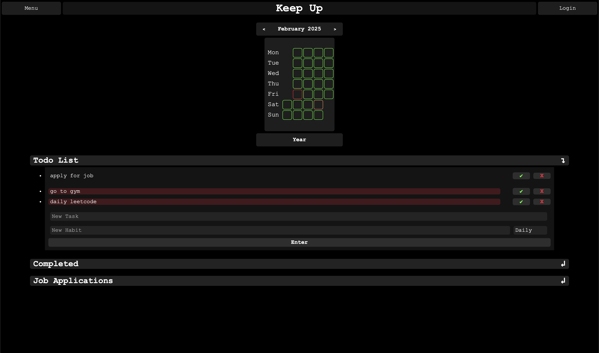
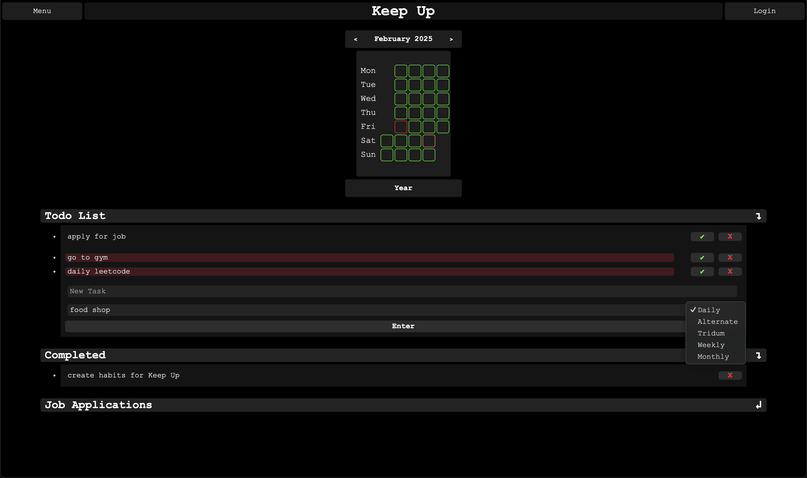
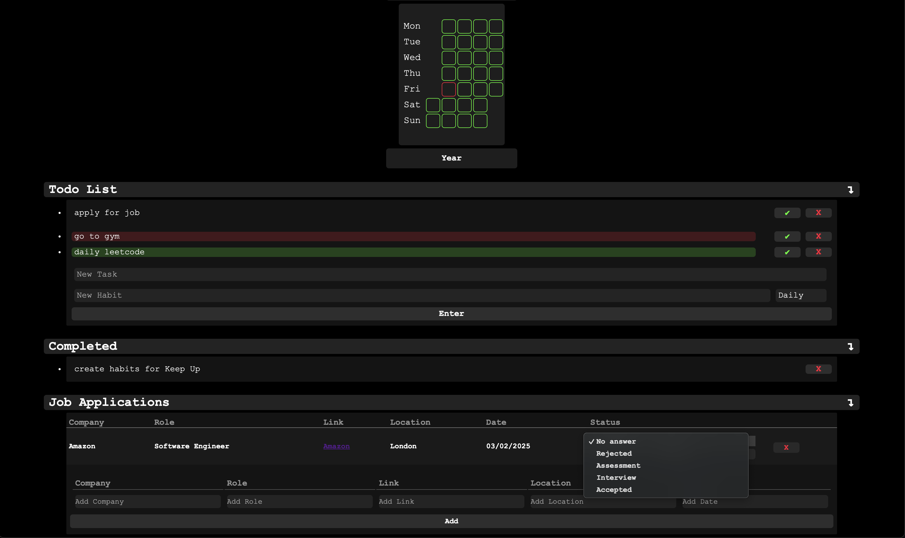
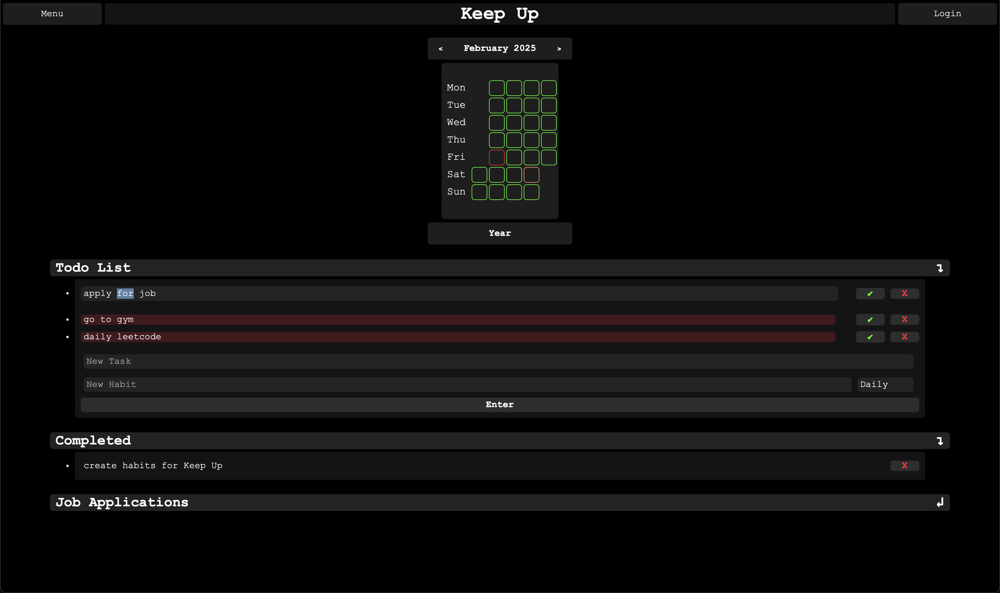
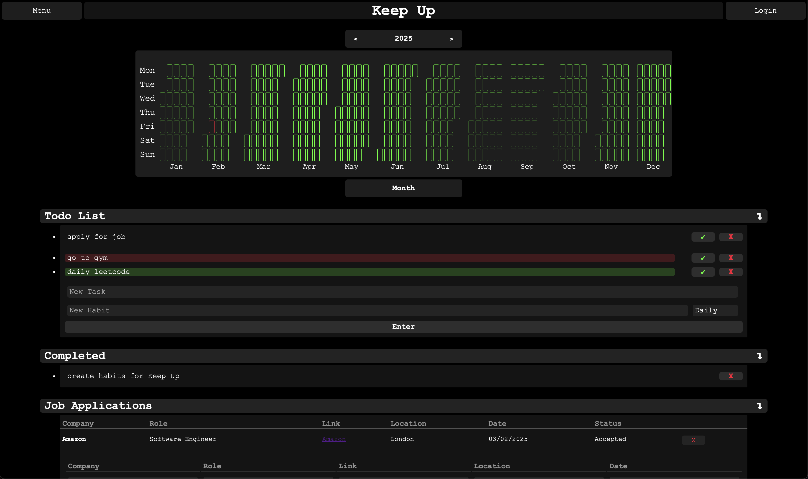

# Keep Up Productivity Tool
Keep Up is a personal productivity management web application built using Flask. It allows users to view a calendar (in both monthly and yearly formats), manage a to-do list, track habits and monitor job applications.

## Table of Contents
- [Features](#features)
- [Screenshots](#screenshots)
- [Project Structure](#project-structure)
- [Installation](#installation)
- [Running the Application](#running-the-application)
- [Usage](#usage)
- [Coming Soon](#coming-soon)
- [Contributions](#contributions)
- [Author](#author)

## Features
- **Calendar View:** Toggle between monthly and yearly displays. Click on the individual dates to select and view habits
scheduled for that day.
- **Todo List:** Add, edit, delete and mark tasks as complete. The list includes collapsible sections for archive and
completed tasks.
- **Habits Tracker:** Create new habits with selectable frequencies (daily, alternate, tridum, weekly, monthly), mark them
as complete for a selected date and view scheduled habits.
- **Job Application Tracker:** Record job applications with details such as company, role, link, location and date.
Update the status of the applications and remove when necessary.

## Screenshots
#### Select Specific Day

#### Select Habit Frequency

#### Select Job Status

#### Click to Edit Task

#### Year View


## Project Structure
```
.
├── README.md
├── config.py
├── img_README
│   ├── edit_task.png
│   ├── select_freq.png
│   ├── select_specifc_day.png
│   ├── set_job_status.png
│   └── year_view.png
├── requirements.txt
├── scripts
│   ├── build_calendar.py
│   ├── build_habits.py
│   ├── build_job_applications.py
│   └── build_todo.py
└── web_app
    ├── app.py
    ├── static
    │   └── styles.css
    └── templates
        ├── index.html
        └── job_applications.html
```
- **/scripts:** Directory containing python scripts to manage backend of application.
- **/web_app:** Directory containing flask app (app.py), HTML templates and CSS styling.

## Installation
1. Ensure that **Python 3** is installed on your system.
2. Install required packages using pip:
    ```bash
    pip install -r requirements.txt
    ```
3. Create a config.py file in the project root with the following content:
    ```bash
    SECRET_KEY = 'your-secret-key'
    ```
    Replace 'your-secret-key' with a secure key of your choice.

## Running the Application
1. Clone Repository:
   ```bash
   git clone https://github.com/hub-mm/keep_up_productivity_tool.git
   ```
2. Navigate to project root:
    ```bash
    cd keep_up_productivity_tool
    ```
3. Setup virtual environment (optional):
   ```bash
   python -m venv venv
   source job_app_venv/bin/activate # on macOS/Linux
   .\job_app_venv\Scripts\activate  # on Windows
   ```
4. Run the Flask application by executing:
   ```bash
   python -m web_app.app
   ```
5. Open your web browser and visit http://127.0.0.1:8000/home to view the application.

## Usage
- Use the navigation menu to access different sections such as Home, Job Applications, Todo and Habits.
  - Only ***Job Application*** is currently available.
- Click on a date in the calendar to select that day and view any scheduled habits.
- Add new tasks, habits or job applications using the provided forms.
- Toggle the collapsible sections to show or hide lists as required.

## Coming Soon
- **User login.**
- **Specific pages:** Todo, Habits.
- **Further improvements:** Job Application page.
- **Add heatmap.**

## Contributions
If you wish to contribute, please feel free to fork the repository and submit pull requests with improvements or
new features. Kindly adhere to the project’s coding conventions and maintain consistency with British English
spelling and vocabulary.

## Author
Created by hub-mm. For queries, feel free to reach out or open a GitHub issue. Enjoy your new found productivity!
