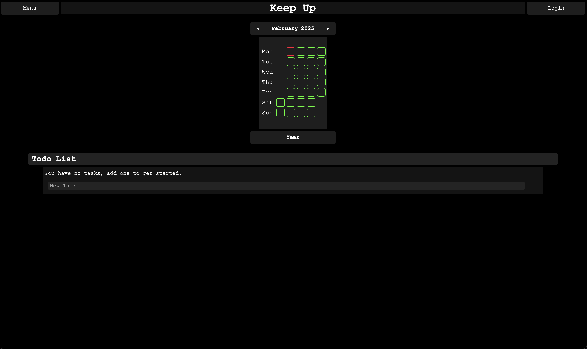
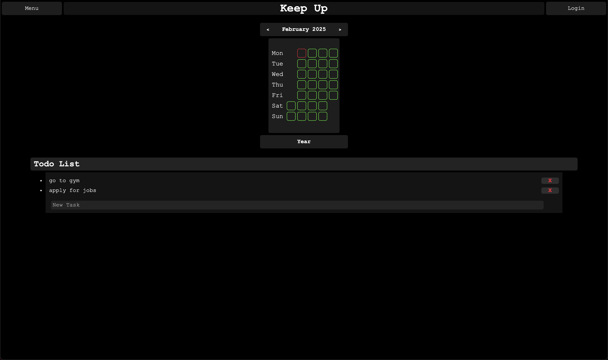

# Keep Up
Life organiser.  
Still in progress...

Built using python for the backend, testing out how to create style in HTML and CSS with no Javascript.

## So far:
### Calendar Month View

### Adding Task Todo

### Year View
